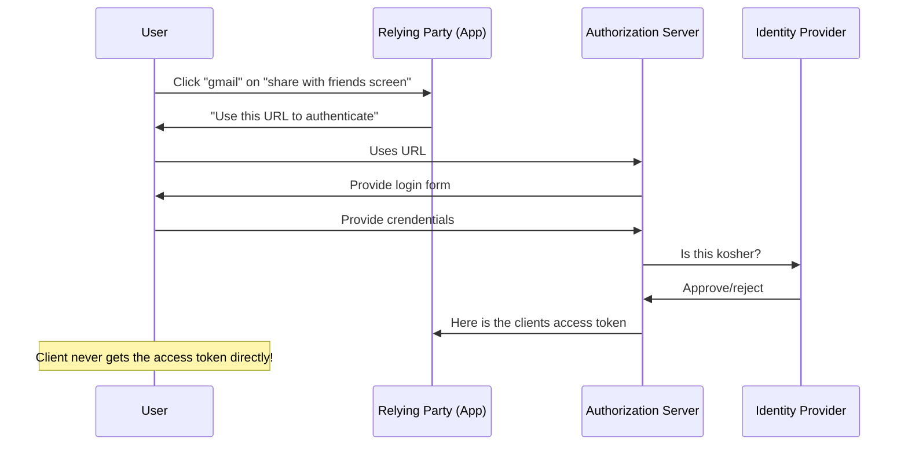

# OpenID Connect
20220221130418

#authentication #oauth2 #security #openid-connect #auth #oidc

**Authentication protocol** built on top of [Oauth2]([[20220221125949]] oauth2) allowing clients to verify **identity** of the user and **get information about the user**

## Summary
- Uses REST/JSON message flows
    - Makes it good for mobile applications because no need to have browser based interaction (cookies etc)
- Easy for developers to use compared to other authentication protocols
    - Stated goal of OIDC
    - Don't need to manage passwords for users
    - Clients of all types and vast language support
    - Secure and verifiable

## Roles

### Identity provider (IDP)
- can answer the question "who is this"
    - Google, Microsoft, Apple, GitHub etc
    - Corporations
- provides authentication as a service

### Relying Party (RP)
- app that is outsourcing user authentication to an IDP

## Example
User (resource owner) wants to allow DogApp (relying party) to send your friends email through Gmail (IDP)

