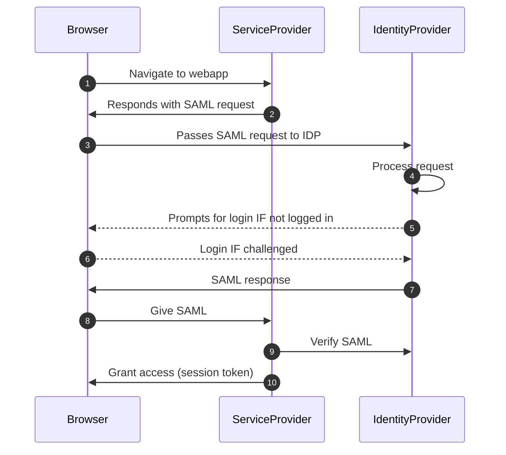

# SAML
20220221130013

Open standard for **authentication** allowing a user to access multiple web applications using one set of credentials

#authentication #auth #security #saml

## Quick facts
- XML based
- used to pass information between an identity provider (idp) and a service provider (sp) like a web app
- widely used in corporations
    - how clients do single sign on with CSOD
- sp does not ever need to know the credentials of the user logging in
    - idps can use MFA etc with the person logging in

## Example flow
